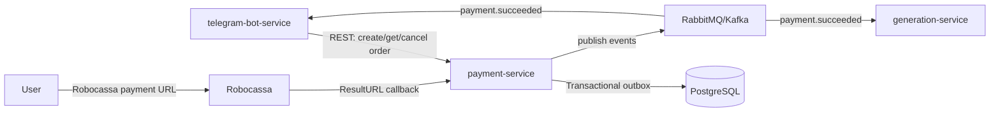

# Архитектура payment-service для NatalAI

## 1. High-level architecture

`payment-service` - отдельный Go-сервис в bounded context `Payments`. Он владеет только платежными заказами, callback от Robocassa, аудитом и transactional outbox. Сервис не читает и не пишет БД `telegram-bot-service` и `generation-service`; интеграция идет через публичный REST API и события.



Рекомендация по коммуникации:

- Команды и синхронные запросы: REST. `telegram-bot-service` создает заказ, получает активный заказ и отменяет заказ через REST.
- Доменные факты: брокер сообщений. `payment.order_created`, `payment.succeeded`, `payment.failed`, `payment.expired` публикуются из outbox.
- На старте проекта достаточно RabbitMQ: проще operational footprint, retry/DLX понятны, throughput платежей невысокий. Kafka имеет смысл, если уже есть в платформе или нужен долгий immutable log для аналитики.
- `payment-service` остается источником истины по платежам. Consumer'ы должны быть идемпотентными.

Архитектура: hexagonal/clean architecture.

- `domain`: сущности, value objects, доменные ошибки и правила статусов. Без Gin, sqlx, zap, Robocassa SDK.
- `application`: use cases, транзакционные сценарии, порты.
- `adapters`: PostgreSQL/sqlx, Robocassa signer, broker publisher, HTTP handlers.
- `cmd`: wiring, config, graceful shutdown.

## 2. Service responsibilities

Сервис отвечает за:

- создание платежного заказа в рублях;
- хранение суммы в копейках (`amount_kopecks int64`), без `float`;
- генерацию Robocassa payment URL;
- выдачу текущего активного заказа пользователя для bot-service;
- прием и проверку `ResultURL` от Robocassa;
- сохранение raw callback payload до или внутри обработки;
- перевод заказа в `paid`;
- публикацию `payment.succeeded` через transactional outbox;
- поддержку повторных callback без повторной смены состояния и без повторной публикации события;
- аудит всех критичных платежных действий;
- expiration/cancel заказов.

Сервис не отвечает за:

- хранение профиля пользователя Telegram;
- генерацию натальной карты;
- бизнес-логику AI-отчета;
- прямые вызовы БД других сервисов;
- синхронный запуск generation-service после оплаты.

## 3. Package layout

```text
cmd/payment-service/main.go

internal/config
internal/http
internal/http/middleware
internal/http/handlers
internal/domain/order
internal/domain/payment
internal/domain/money
internal/domain/events
internal/application
internal/application/commands
internal/application/queries
internal/application/ports
internal/adapters/postgres
internal/adapters/robocassa
internal/adapters/outbox
internal/adapters/broker
internal/observability
internal/worker
internal/tx

migrations
api/openapi.yaml
deployments/docker
deployments/k8s
```

Ответственность пакетов:

- `cmd/payment-service/main.go`: чтение env, создание зависимостей, запуск HTTP-сервера и workers, graceful shutdown.
- `internal/config`: env config, валидация обязательных переменных, duration parsing.
- `internal/http`: Gin router, health/readiness endpoints, error mapping.
- `internal/http/middleware`: request id, recovery, logging, auth для internal API, timeout.
- `internal/http/handlers`: DTO, валидация входа, вызов use cases. Без SQL и доменной логики.
- `internal/domain/order`: aggregate `Order`, статусы, переходы, инварианты.
- `internal/domain/payment`: callback/payment attempt/value objects Robocassa.
- `internal/domain/money`: `Money{AmountKopecks int64, Currency string}`.
- `internal/domain/events`: имена событий, payload-структуры, idempotency key.
- `internal/application/commands`: `CreateOrder`, `CancelOrder`, `HandleRobocassaResult`, `ExpireOrders`, `PublishOutboxEvents`.
- `internal/application/queries`: `GetActiveOrder`, `GetOrder`.
- `internal/application/ports`: интерфейсы репозиториев, gateway Robocassa, outbox, publisher, clock.
- `internal/adapters/postgres`: sqlx repositories, transaction manager, explicit SQL.
- `internal/adapters/robocassa`: подписи, проверка callback, генерация URL.
- `internal/adapters/outbox`: выборка pending-событий, claim/mark published/mark failed.
- `internal/adapters/broker`: RabbitMQ/Kafka publisher.
- `internal/observability`: zap logger, metrics, tracing, `/metrics`.
- `internal/worker`: loops для outbox publisher и order expiration.
- `internal/tx`: `WithinTx(ctx, fn)` abstraction поверх `sqlx.Tx`.
- `migrations`: golang-migrate SQL.
- `api/openapi.yaml`: REST contracts.

Правило зависимостей: `domain` не импортирует ничего из `application` и `adapters`; `application` импортирует `domain` и свои `ports`; `adapters` реализуют порты.

## 4. Database schema explanation

Основные таблицы:

- `payment_orders`: заказ на оплату.
- `payment_callbacks`: все входящие callback Robocassa с raw payload.
- `payment_audit_log`: аудит доменных изменений.
- `outbox_events`: transactional outbox.
- `idempotency_keys`: идемпотентность внутренних REST-команд.

Пример миграции:

```sql
CREATE TYPE payment_order_status AS ENUM (
  'pending',
  'paid',
  'cancelled',
  'expired',
  'failed'
);

CREATE TABLE payment_orders (
  id UUID PRIMARY KEY,
  user_id TEXT NOT NULL,
  generation_id UUID NOT NULL,
  status payment_order_status NOT NULL,
  amount_kopecks BIGINT NOT NULL CHECK (amount_kopecks > 0),
  currency CHAR(3) NOT NULL CHECK (currency = 'RUB'),
  description TEXT NOT NULL,
  robocassa_inv_id BIGSERIAL UNIQUE NOT NULL,
  payment_url TEXT NOT NULL,
  idempotency_key TEXT NOT NULL,
  paid_at TIMESTAMPTZ,
  cancelled_at TIMESTAMPTZ,
  expires_at TIMESTAMPTZ NOT NULL,
  created_at TIMESTAMPTZ NOT NULL DEFAULT now(),
  updated_at TIMESTAMPTZ NOT NULL DEFAULT now(),
  version BIGINT NOT NULL DEFAULT 1,
  CONSTRAINT uq_payment_orders_idempotency UNIQUE (idempotency_key),
  CONSTRAINT chk_paid_at CHECK ((status = 'paid' AND paid_at IS NOT NULL) OR status <> 'paid')
);

CREATE UNIQUE INDEX uq_payment_orders_one_active
  ON payment_orders (user_id, generation_id)
  WHERE status = 'pending';

CREATE INDEX idx_payment_orders_active_by_user
  ON payment_orders (user_id, created_at DESC)
  WHERE status = 'pending';

CREATE INDEX idx_payment_orders_expiration
  ON payment_orders (expires_at)
  WHERE status = 'pending';

CREATE TABLE payment_callbacks (
  id UUID PRIMARY KEY,
  provider TEXT NOT NULL CHECK (provider = 'robocassa'),
  callback_type TEXT NOT NULL CHECK (callback_type IN ('result', 'success', 'fail')),
  inv_id BIGINT NOT NULL,
  out_sum TEXT NOT NULL,
  signature TEXT NOT NULL,
  raw_query TEXT,
  raw_body BYTEA,
  headers JSONB NOT NULL DEFAULT '{}'::jsonb,
  parsed_payload JSONB NOT NULL DEFAULT '{}'::jsonb,
  signature_valid BOOLEAN NOT NULL,
  processing_status TEXT NOT NULL CHECK (processing_status IN ('received', 'processed', 'ignored', 'invalid')),
  error TEXT,
  received_at TIMESTAMPTZ NOT NULL DEFAULT now(),
  processed_at TIMESTAMPTZ,
  CONSTRAINT uq_robocassa_result_callback UNIQUE (provider, callback_type, inv_id, out_sum, signature)
);

CREATE INDEX idx_payment_callbacks_inv_id
  ON payment_callbacks (inv_id, received_at DESC);

CREATE TABLE payment_audit_log (
  id UUID PRIMARY KEY,
  order_id UUID REFERENCES payment_orders(id),
  event_type TEXT NOT NULL,
  actor TEXT NOT NULL,
  payload JSONB NOT NULL,
  created_at TIMESTAMPTZ NOT NULL DEFAULT now()
);

CREATE TABLE outbox_events (
  id UUID PRIMARY KEY,
  aggregate_type TEXT NOT NULL,
  aggregate_id UUID NOT NULL,
  event_type TEXT NOT NULL,
  payload JSONB NOT NULL,
  idempotency_key TEXT NOT NULL UNIQUE,
  status TEXT NOT NULL CHECK (status IN ('pending', 'processing', 'published', 'failed')),
  attempts INT NOT NULL DEFAULT 0,
  next_attempt_at TIMESTAMPTZ NOT NULL DEFAULT now(),
  locked_at TIMESTAMPTZ,
  locked_by TEXT,
  published_at TIMESTAMPTZ,
  last_error TEXT,
  created_at TIMESTAMPTZ NOT NULL DEFAULT now()
);

CREATE INDEX idx_outbox_pending
  ON outbox_events (next_attempt_at, created_at)
  WHERE status IN ('pending', 'failed');

CREATE TABLE idempotency_keys (
  key TEXT PRIMARY KEY,
  scope TEXT NOT NULL,
  request_hash TEXT NOT NULL,
  response_status INT NOT NULL,
  response_body JSONB NOT NULL,
  created_at TIMESTAMPTZ NOT NULL DEFAULT now(),
  expires_at TIMESTAMPTZ NOT NULL
);
```

Примечания:

- `robocassa_inv_id` - числовой `InvId`, удобный для Robocassa. Внутренний `id` остается UUID.
- `payment_callbacks.raw_query/raw_body/headers` нужны для аудита и повторного разбора.
- `outbox_events.idempotency_key` защищает от дублей событий при retry транзакции.
- Для финансового сценария изменение статуса заказа выполняется в транзакции с `SELECT ... FOR UPDATE`.

## 5. API contracts

Все internal REST endpoints версионируются: `/api/v1`. Для внутренних команд требуется service-to-service auth: `Authorization: Bearer <internal-token>` или mTLS в Kubernetes.

### `POST /api/v1/orders`

Создает заказ и возвращает Robocassa URL. Идемпотентность: обязательный заголовок `Idempotency-Key`.

Request:

```json
{
  "user_id": "telegram:123456789",
  "generation_id": "8db7c2bd-01d5-4c24-83da-e7687aa3b111",
  "amount_kopecks": 149000,
  "currency": "RUB",
  "description": "NatalAI natal chart report"
}
```

Response `201` или повторный `200`:

```json
{
  "order_id": "018fe657-bca0-7cc1-a06d-17b54e21d907",
  "status": "pending",
  "amount_kopecks": 149000,
  "currency": "RUB",
  "payment_url": "https://auth.robokassa.ru/Merchant/Index.aspx?...",
  "expires_at": "2026-06-05T19:30:00Z"
}
```

Ошибки:

- `400`: некорректная сумма, не `RUB`, пустой `user_id`.
- `401/403`: невалидная service auth.
- `409`: активный заказ уже существует, если не совпал idempotency key.
- `422`: unsupported product/amount policy, если добавится product catalog.

### `GET /api/v1/users/{user_id}/active-order?generation_id=...`

Возвращает текущий активный `pending` order для пользователя и generation.

Response `200`:

```json
{
  "order_id": "018fe657-bca0-7cc1-a06d-17b54e21d907",
  "generation_id": "8db7c2bd-01d5-4c24-83da-e7687aa3b111",
  "status": "pending",
  "amount_kopecks": 149000,
  "currency": "RUB",
  "payment_url": "https://auth.robokassa.ru/Merchant/Index.aspx?...",
  "expires_at": "2026-06-05T19:30:00Z"
}
```

`404`, если активного заказа нет.

### `POST /api/v1/orders/{order_id}/cancel`

Идемпотентная отмена `pending` заказа. Заголовок `Idempotency-Key` обязателен.

Response:

```json
{
  "order_id": "018fe657-bca0-7cc1-a06d-17b54e21d907",
  "status": "cancelled"
}
```

Если заказ уже `paid`, вернуть `409`.

### `POST|GET /api/v1/robocassa/result`

Публичный endpoint для `ResultURL`. При успехе Robocassa ожидает plain text:

```text
OK{InvId}
```

Например:

```text
OK12345
```

При невалидной подписи вернуть `400`, но raw callback все равно сохранять с `signature_valid=false`.

### `GET /api/v1/orders/{order_id}`

Internal read endpoint для диагностики и поддержки.

### `GET /healthz`

Liveness: процесс жив. Не проверяет БД.

### `GET /readyz`

Readiness: проверяет `db.PingContext(ctx)`, доступность migrations state, опционально broker connectivity.

## 6. Robocassa integration

Robocassa payment URL генерируется adapter'ом `internal/adapters/robocassa`. Домен знает только о том, что есть `PaymentURL`, но не знает формат подписи.

Env config:

```text
ROBOCASSA_MERCHANT_LOGIN
ROBOCASSA_PASSWORD1
ROBOCASSA_PASSWORD2
ROBOCASSA_IS_TEST
ROBOCASSA_BASE_URL
PUBLIC_BASE_URL
```

Payment URL:

- `MerchantLogin`
- `OutSum`, например `"1490.00"` из `149000` копеек
- `InvId` = `payment_orders.robocassa_inv_id`
- `Description`
- `SignatureValue`
- `IsTest=1` для sandbox
- `Shp_order_id=<uuid>`
- `Shp_generation_id=<uuid>`

Сумма внутри сервиса хранится только в копейках. Для Robocassa форматируется decimal string:

```go
func FormatRubKopecks(v int64) string {
    rub := v / 100
    kop := v % 100
    return fmt.Sprintf("%d.%02d", rub, kop)
}
```

Проверка `ResultURL`:

- принять query/form параметры;
- сохранить raw payload в `payment_callbacks`;
- найти order по `InvId`;
- сравнить `OutSum` с ожидаемой суммой, форматированной из `amount_kopecks`;
- проверить подпись по `Password2`;
- проверить все `Shp_*`, если они участвуют в подписи;
- внутри транзакции сделать `SELECT ... FOR UPDATE` order;
- если order уже `paid`, сохранить callback как `ignored/processed` и вернуть `OK{InvId}`;
- если order `pending` и подпись валидна, перевести в `paid`, записать audit, записать outbox `payment.succeeded`.

Порт:

```go
type RobocassaGateway interface {
    BuildPaymentURL(ctx context.Context, input BuildPaymentURLInput) (string, error)
    VerifyResult(ctx context.Context, payload RobocassaResultPayload, order OrderSnapshot) error
}
```

## 7. Event contracts

Общее:

- event envelope публикуется в broker из `outbox_events`;
- `event_id` = `outbox_events.id`;
- `occurred_at` = время создания события;
- `idempotency_key` уникален и стабилен;
- ключ маршрутизации: `payment.<event_name>`.

Envelope:

```json
{
  "event_id": "527ad4e1-65e1-40f3-bb95-e6a1b18f0001",
  "event_type": "payment.succeeded",
  "event_version": 1,
  "occurred_at": "2026-06-05T18:00:00Z",
  "idempotency_key": "payment.succeeded:018fe657-bca0-7cc1-a06d-17b54e21d907",
  "payload": {}
}
```

### `payment.order_created`

Когда: после создания order.

`idempotency_key`: `payment.order_created:{order_id}`.

Payload:

```json
{
  "order_id": "018fe657-bca0-7cc1-a06d-17b54e21d907",
  "user_id": "telegram:123456789",
  "generation_id": "8db7c2bd-01d5-4c24-83da-e7687aa3b111",
  "amount_kopecks": 149000,
  "currency": "RUB",
  "status": "pending",
  "payment_url": "https://auth.robokassa.ru/Merchant/Index.aspx?...",
  "expires_at": "2026-06-05T19:30:00Z"
}
```

Consumers:

- `telegram-bot-service`: может отправить/обновить ссылку пользователю, если создание заказа было инициировано не им.

### `payment.succeeded`

Когда: валидный `ResultURL`, order переведен в `paid`.

`idempotency_key`: `payment.succeeded:{order_id}`.

Payload:

```json
{
  "order_id": "018fe657-bca0-7cc1-a06d-17b54e21d907",
  "user_id": "telegram:123456789",
  "generation_id": "8db7c2bd-01d5-4c24-83da-e7687aa3b111",
  "amount_kopecks": 149000,
  "currency": "RUB",
  "provider": "robocassa",
  "robocassa_inv_id": 12345,
  "paid_at": "2026-06-05T18:03:15Z"
}
```

Consumers:

- `telegram-bot-service`: уведомить пользователя, что оплата прошла.
- `generation-service`: начать/разблокировать генерацию отчета по `generation_id`.

### `payment.failed`

Когда: явный failure callback/ручная reconciliation-проверка показала неуспешную оплату. Не использовать для невалидной подписи как бизнес-событие; это security/audit incident.

`idempotency_key`: `payment.failed:{order_id}`.

Payload:

```json
{
  "order_id": "018fe657-bca0-7cc1-a06d-17b54e21d907",
  "user_id": "telegram:123456789",
  "generation_id": "8db7c2bd-01d5-4c24-83da-e7687aa3b111",
  "amount_kopecks": 149000,
  "currency": "RUB",
  "reason": "robocassa_fail_url",
  "failed_at": "2026-06-05T18:10:00Z"
}
```

Consumers:

- `telegram-bot-service`: предложить повторить оплату.
- `generation-service`: обычно игнорирует или снимает payment wait state, если он есть.

### `payment.expired`

Когда: worker `ExpireOrders` перевел `pending` order в `expired`.

`idempotency_key`: `payment.expired:{order_id}`.

Payload:

```json
{
  "order_id": "018fe657-bca0-7cc1-a06d-17b54e21d907",
  "user_id": "telegram:123456789",
  "generation_id": "8db7c2bd-01d5-4c24-83da-e7687aa3b111",
  "amount_kopecks": 149000,
  "currency": "RUB",
  "expired_at": "2026-06-05T19:30:01Z"
}
```

Consumers:

- `telegram-bot-service`: убрать старую ссылку/предложить создать новую.
- `generation-service`: может освободить ожидание оплаты.

## 8. Critical flows

### CreateOrder

1. Gin handler валидирует JSON и `Idempotency-Key`.
2. Use case считает `request_hash`.
3. В транзакции:
   - проверить `idempotency_keys` по key/scope;
   - если найден тот же hash, вернуть сохраненный response;
   - если key найден с другим hash, вернуть `409`;
   - проверить отсутствие активного `pending` order по `(user_id, generation_id)`;
   - создать `payment_orders` со статусом `pending`;
   - сгенерировать Robocassa URL;
   - обновить `payment_url`;
   - вставить audit `order_created`;
   - вставить outbox `payment.order_created`;
   - сохранить idempotency response.
4. Commit.
5. Вернуть response.

Если генерация URL не требует сети, ее можно делать внутри транзакции. Если Robocassa API станет сетевым вызовом, сначала резервировать order, затем выполнять внешний вызов с осторожной компенсацией; в текущей URL-signing модели сетевого вызова нет.

### GetActiveOrder

1. Проверить service auth.
2. `SELECT ... WHERE user_id=$1 AND generation_id=$2 AND status='pending' AND expires_at > now() ORDER BY created_at DESC LIMIT 1`.
3. Вернуть `404`, если нет.

### CancelOrder

1. Проверить `Idempotency-Key`.
2. В транзакции:
   - `SELECT ... FOR UPDATE`;
   - если `cancelled`, вернуть текущий статус;
   - если `paid`, вернуть `409`;
   - если `pending`, перевести в `cancelled`;
   - записать audit.
3. Commit.

Событие `payment.failed` не публиковать для обычной пользовательской отмены, если продуктово это не считается failure.

### HandleRobocassaResult

1. Handler считывает query/form/body и headers.
2. Вставляет `payment_callbacks` с raw payload. При дубле по unique constraint получает существующий callback и продолжает идемпотентно.
3. Находит order по `robocassa_inv_id`.
4. Проверяет сумму и подпись.
5. В транзакции:
   - `SELECT payment_orders ... FOR UPDATE`;
   - если callback уже processed и order paid, вернуть `OK`;
   - если подпись невалидна, callback `invalid`, audit `robocassa_invalid_signature`, commit, вернуть `400`;
   - если order `paid`, callback `ignored`, commit, вернуть `OK`;
   - если order не `pending`, callback `ignored`, audit, commit, вернуть `OK`;
   - если order `pending`, `UPDATE status='paid', paid_at=now()`;
   - callback `processed`;
   - audit `order_paid`;
   - outbox `payment.succeeded` с unique idempotency key.
6. Commit.
7. Вернуть `OK{InvId}`.

### ExpireOrders

Worker каждые N секунд батчами:

```sql
SELECT id
FROM payment_orders
WHERE status = 'pending' AND expires_at < now()
ORDER BY expires_at
LIMIT 100
FOR UPDATE SKIP LOCKED;
```

Для каждого заказа в той же транзакции:

- status `expired`;
- audit `order_expired`;
- outbox `payment.expired`.

### PublishOutboxEvents

1. Claim batch:

```sql
UPDATE outbox_events
SET status = 'processing',
    locked_at = now(),
    locked_by = $1,
    attempts = attempts + 1
WHERE id IN (
  SELECT id
  FROM outbox_events
  WHERE status IN ('pending', 'failed')
    AND next_attempt_at <= now()
  ORDER BY created_at
  LIMIT $2
  FOR UPDATE SKIP LOCKED
)
RETURNING *;
```

2. Publish to broker with message key = `idempotency_key`.
3. On success: `status='published', published_at=now()`.
4. On failure: `status='failed', next_attempt_at=now()+backoff(attempts), last_error=$err`.

## 9. Failure handling and idempotency

Критичные идемпотентные точки:

- `POST /orders`: `Idempotency-Key` + `request_hash` + saved response.
- `POST /orders/{id}/cancel`: `Idempotency-Key`.
- Robocassa callback: unique `(provider, callback_type, inv_id, out_sum, signature)`.
- Domain event: unique `outbox_events.idempotency_key`.
- State transition: guarded by current status and row lock.
- Consumer side: `payment.succeeded:{order_id}` должен обрабатываться один раз.

Транзакции:

- `CreateOrder`: order + audit + outbox + idempotency response в одной транзакции.
- `HandleRobocassaResult`: callback state + order paid + audit + outbox в одной транзакции.
- `ExpireOrders`: status update + audit + outbox в одной транзакции.
- `PublishOutboxEvents`: claim и mark отдельными короткими транзакциями; publish не держит DB transaction.

Изоляция:

- PostgreSQL `READ COMMITTED` + `SELECT FOR UPDATE` достаточно для single-row order transitions.
- При serialization/deadlock ошибках (`40001`, `40P01`) retry entire transaction с bounded backoff.

Поведение при сбоях:

- Robocassa повторит callback, если не получила `OK{InvId}`. Поэтому callback handler должен быть быстрым и идемпотентным.
- Если broker недоступен, order остается `paid`, событие остается в outbox и публикуется позже.
- Если сервис упал после commit и до publish, outbox worker восстановит публикацию.
- Если callback пришел после `expired`, но Robocassa подпись валидна и сумма совпала, решение зависит от product policy. Рекомендация: переводить `expired -> paid`, потому что деньги фактически получены; audit должен зафиксировать late payment. Если бизнес хочет иначе, нужна refund/reconciliation процедура.

Пример application ports:

```go
type OrderRepository interface {
    Create(ctx context.Context, tx Tx, order *order.Order) error
    GetByIDForUpdate(ctx context.Context, tx Tx, id uuid.UUID) (*order.Order, error)
    GetByRobocassaInvIDForUpdate(ctx context.Context, tx Tx, invID int64) (*order.Order, error)
    GetActive(ctx context.Context, userID string, generationID uuid.UUID) (*order.Order, error)
    Save(ctx context.Context, tx Tx, order *order.Order) error
}

type OutboxRepository interface {
    Add(ctx context.Context, tx Tx, event events.OutboxEvent) error
    ClaimBatch(ctx context.Context, workerID string, limit int) ([]events.OutboxEvent, error)
    MarkPublished(ctx context.Context, eventID uuid.UUID) error
    MarkFailed(ctx context.Context, eventID uuid.UUID, nextAttemptAt time.Time, err string) error
}

type TxManager interface {
    WithinTx(ctx context.Context, opts *sql.TxOptions, fn func(ctx context.Context, tx Tx) error) error
}
```

## 10. Security

- Internal REST API закрыть service token, mTLS или ingress allowlist.
- Public Robocassa endpoints не требуют internal auth, но обязаны проверять подпись.
- Секреты Robocassa хранить только в env/secret manager, не логировать.
- Не логировать полный payment URL, если он содержит подпись; логировать `order_id`, `inv_id`, `amount_kopecks`.
- Rate limit на public callback endpoints по IP/route, но не слишком жесткий, чтобы не ломать Robocassa retries.
- Все SQL - parameterized, через `sqlx.GetContext/SelectContext/ExecContext`.
- Все DB/external операции принимают `context.Context`.
- Request body limit для Gin.
- Validate `amount_kopecks > 0`, `currency == RUB`, UUID format.
- Raw callback payload хранить, но доступ к нему ограничить: это audit/security data.
- Для админ/diagnostic endpoints нужна отдельная роль или закрытая сеть.

## 11. Observability

Logging: zap structured logs.

Обязательные поля:

- `request_id`
- `trace_id`
- `order_id`
- `user_id`
- `generation_id`
- `robocassa_inv_id`
- `event_type`
- `idempotency_key`
- `duration_ms`
- `error`

Metrics:

- `http_requests_total{route,method,status}`
- `http_request_duration_seconds{route,method}`
- `payment_orders_created_total`
- `payment_orders_paid_total`
- `payment_orders_expired_total`
- `robocassa_callbacks_total{valid,status}`
- `outbox_events_pending`
- `outbox_publish_attempts_total{event_type,result}`
- `outbox_publish_lag_seconds`
- `db_query_duration_seconds{operation}`

Tracing:

- OpenTelemetry instrumentation для HTTP, DB и broker publish.
- Протаскивать trace context в event headers.

Health:

- `/healthz`: процесс отвечает.
- `/readyz`: PostgreSQL ping с timeout, migration version доступна, broker optional или degraded в зависимости от политики деплоя.

Graceful shutdown:

- `http.Server.Shutdown(ctx)`
- stop signal для workers;
- дождаться завершения текущего outbox publish batch;
- закрыть DB pool и broker connection;
- общий deadline, например 20-30 секунд.

## 12. Testing strategy

Unit tests:

- domain transitions: `pending -> paid`, `pending -> cancelled`, `pending -> expired`, duplicate paid.
- `Money` formatting в Robocassa decimal string.
- signature verification Robocassa.
- use cases через in-memory ports.
- table-driven tests с named subtests.

HTTP tests:

- Gin handlers через `httptest`;
- validation errors;
- idempotency headers;
- Robocassa `ResultURL` response body `OK{InvId}`.

Integration tests:

- PostgreSQL через testcontainers или docker-compose;
- build tag `//go:build integration`;
- миграции golang-migrate на чистой БД;
- `SELECT FOR UPDATE SKIP LOCKED` для outbox и expiration;
- unique constraints для идемпотентности.

Contract tests:

- OpenAPI проверка request/response для bot-service.
- Event schema tests: JSON payload соответствует версии `event_version=1`.

Failure tests:

- повторный Robocassa callback не создает второй `payment.succeeded`;
- broker down: событие остается pending/failed в outbox;
- DB transaction rollback не оставляет audit/outbox без order;
- retry transaction на deadlock/serialization.

CI:

```bash
go test ./...
go test -race ./...
go test -tags=integration ./...
golangci-lint run ./...
migrate -path migrations -database "$TEST_DATABASE_URL" up
```

## 13. Implementation roadmap

1. Создать Go module, базовый `cmd/payment-service`, config env, zap, Gin, graceful shutdown.
2. Добавить migrations: enum statuses, `payment_orders`, `payment_callbacks`, `payment_audit_log`, `outbox_events`, `idempotency_keys`.
3. Реализовать domain модели и state transitions.
4. Реализовать application ports и transaction manager.
5. Реализовать PostgreSQL repositories на `sqlx`.
6. Реализовать Robocassa adapter: build URL, verify ResultURL.
7. Реализовать use cases: `CreateOrder`, `GetActiveOrder`, `CancelOrder`, `HandleRobocassaResult`.
8. Добавить Gin handlers и OpenAPI.
9. Реализовать outbox worker и broker publisher.
10. Добавить expiration worker.
11. Добавить metrics/tracing/readiness.
12. Покрыть unit/integration/contract tests.
13. Подготовить Dockerfile, docker-compose для локальной разработки, Kubernetes manifests/Helm.
14. Настроить CI/CD: lint, tests, migrations, image build, deploy.

Deployment:

- Docker multi-stage build.
- Non-root user.
- Env-based config.
- PostgreSQL migrations отдельным CI/CD job или init job.
- Kubernetes probes:
  - liveness `/healthz`
  - readiness `/readyz`
- Horizontal scaling допустим: row locks и `SKIP LOCKED` защищают workers от двойной обработки.

Минимальный env:

```text
APP_ENV=production
HTTP_ADDR=:8080
DATABASE_URL=postgres://...
INTERNAL_API_TOKEN=...
PUBLIC_BASE_URL=https://payments.natalai.ru
ROBOCASSA_MERCHANT_LOGIN=...
ROBOCASSA_PASSWORD1=...
ROBOCASSA_PASSWORD2=...
ROBOCASSA_IS_TEST=false
BROKER_KIND=rabbitmq
BROKER_URL=amqp://...
OUTBOX_WORKER_ENABLED=true
EXPIRE_WORKER_ENABLED=true
ORDER_TTL=30m
LOG_LEVEL=info
```

## 14. Open questions / assumptions

- Цена приходит от bot-service или должна храниться в payment-service как product catalog? Для платежей безопаснее, чтобы payment-service сам валидировал allowed price/product, а не доверял произвольной сумме от bot-service.
- Один `generation_id` может иметь только один успешный payment? В схеме предполагается один активный pending order, но исторически может быть несколько expired/cancelled.
- Что делать с валидной оплатой после expiration: рекомендовано засчитывать как `paid`, потому что деньги получены.
- Нужен ли refund flow? В текущий scope не включен, но статусная модель должна позволить добавить `refunded`.
- Нужен ли admin API для ручной reconciliation с Robocassa? Для production желательно добавить отдельным этапом.
- Какой брокер уже есть в инфраструктуре NatalAI? Если брокера нет, начать с RabbitMQ; если Kafka уже используется, публиковать outbox туда.
- Нужна ли PII-классификация `user_id`? Если это Telegram ID, доступы к audit/raw payload должны быть ограничены.
